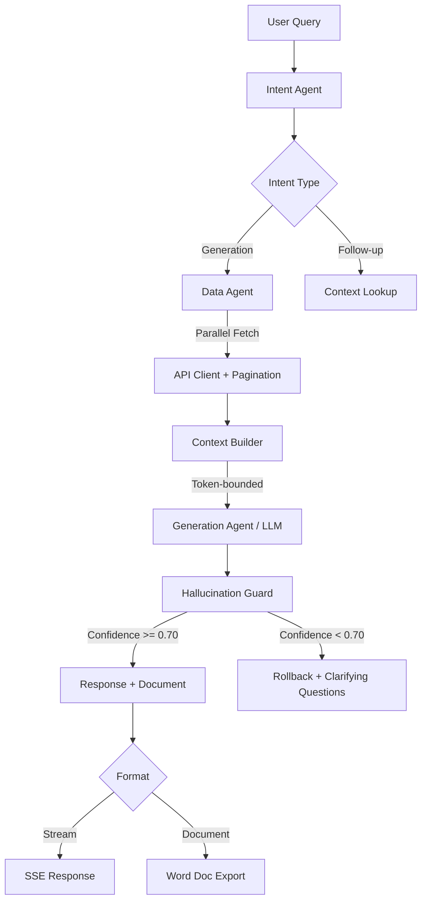

# Agentic Document Generator


AI-powered intelligent document generation agent with parallel data retrieval, streaming SSE responses, hallucination guard with confidence-based rollback, granular token tracking, and Microsoft Word export.

---

## Architecture



---

## Features

- **Parallel Phase 1 + Phase 2 pipeline** for low-latency responses
- **Auto-paginated data retrieval** with deduplication across API pages
- **Token-bounded context assembly** supporting a 120K token window
- **Hallucination guard** with confidence scoring and automatic rollback
- **Granular per-step token and cost tracking** (phase1, phase2, pre_llm, llm)
- **Microsoft Word document generation** via python-docx with structured formatting
- **SSE streaming** with real-time token updates
- **Two-level caching:** L1 in-memory (cachetools TTLCache) + L2 Redis (optional)
- **Session-aware conversation history** with anti-hallucination filtering

---

## Tech Stack

| Component | Technology |
|-----------|-----------|
| Framework | FastAPI |
| LLM | OpenAI GPT-4.1-mini |
| Document Export | python-docx |
| Caching | cachetools (L1) + Redis (L2) |
| Data Source | MongoDB HTTP API |
| Token Counting | tiktoken |
| Streaming | SSE (Server-Sent Events) |

---

## Quick Start

```bash
git clone https://github.com/AniruddhaPKawarase/agentic-doc-generator.git
cd agentic-doc-generator
python -m venv venv
source venv/bin/activate      # Linux/macOS
# venv\Scripts\activate       # Windows
pip install -r requirements.txt
cp .env.example .env
# Edit .env with your API keys and configuration
python main.py
```

The server starts on `http://localhost:8003` by default.

---

## API Reference

| Method | Endpoint | Description |
|--------|----------|-------------|
| `GET` | `/` | Service info or frontend |
| `GET` | `/health` | Health check (Redis, OpenAI status) |
| `POST` | `/api/chat` | Submit query (blocking response) |
| `POST` | `/api/chat/stream` | Submit query (SSE streaming) |
| `GET` | `/api/documents/{id}` | Download generated document |
| `GET` | `/api/documents` | List generated documents |
| `GET` | `/api/projects/{id}/context` | Load project context |
| `GET` | `/api/projects` | List available projects |

### Examples

**Blocking chat request:**

```bash
curl -X POST http://localhost:8003/api/chat \
  -H "Content-Type: application/json" \
  -d '{
    "query": "Generate a scope document for Electrical trade",
    "project_id": "7166",
    "session_id": "optional-session-uuid"
  }'
```

**Streaming chat request (SSE):**

```bash
curl -N -X POST http://localhost:8003/api/chat/stream \
  -H "Content-Type: application/json" \
  -d '{
    "query": "Generate a scope document for Plumbing trade",
    "project_id": "7166",
    "session_id": "optional-session-uuid"
  }'
```

---

## Project Structure

```
agentic-doc-generator/
├── main.py                          # FastAPI application entry point
├── config.py                        # Configuration (env vars, constants)
├── requirements.txt                 # Python dependencies
├── .env.example                     # Environment variable template
├── LICENSE                          # MIT License
├── agents/
│   ├── __init__.py
│   ├── intent_agent.py              # Query intent classification
│   ├── data_agent.py                # Data retrieval orchestration
│   └── generation_agent.py          # LLM generation + pipeline orchestrator
├── models/
│   ├── __init__.py
│   └── schemas.py                   # Pydantic request/response models
├── routers/
│   ├── __init__.py
│   ├── chat.py                      # /api/chat and /api/chat/stream
│   ├── documents.py                 # /api/documents endpoints
│   └── projects.py                  # /api/projects endpoints
├── services/
│   ├── __init__.py
│   ├── api_client.py                # Auto-paginated HTTP client
│   ├── cache_service.py             # L1 + L2 cache layer
│   ├── context_builder.py           # Token-bounded context assembly
│   ├── document_generator.py        # Word document generation
│   ├── exhibit_document_generator.py # Exhibit-format document generation
│   ├── hallucination_guard.py       # Confidence scoring + rollback
│   ├── session_service.py           # Conversation session management
│   ├── sql_service.py               # SQL Server project name lookup
│   └── token_tracker.py             # Per-step token/cost tracking
├── s3_utils/
│   ├── __init__.py
│   ├── client.py                    # S3 client wrapper
│   ├── config.py                    # S3 configuration
│   ├── helpers.py                   # S3 helper utilities
│   └── operations.py               # S3 CRUD operations
├── utils/
│   ├── __init__.py
│   ├── text_processor.py            # Text normalization utilities
│   └── token_counter.py             # tiktoken-based token counting
├── scripts/
│   └── migrate_docs_to_s3.py        # Migration script for S3 storage
└── tests/
    ├── __init__.py
    ├── test_scope.py                # Scope generation tests
    ├── test_streaming.py            # SSE streaming tests
    ├── test_s3_construction.py      # S3 integration tests
    └── excel_loader.py              # Test data loader utility
```

---

## Hallucination Guard

The hallucination guard is a critical safety layer that evaluates every LLM response before it reaches the user.

**How it works:**

1. After the LLM generates a response, the guard scores its **groundedness** against the retrieved source data.
2. If the confidence score is **>= 0.70**, the response is delivered normally.
3. If the confidence score is **< 0.70**, a **rollback** is triggered:
   - The generated response is discarded.
   - The user receives clarifying questions to refine their query.
   - The low-confidence response is **not cached** to prevent propagation.
   - The message is filtered from session history to avoid poisoning future context.

**Configuration:**

| Variable | Default | Description |
|----------|---------|-------------|
| `HALLUCINATION_CONFIDENCE_THRESHOLD` | `0.70` | Minimum confidence to accept a response |
| `HALLUCINATION_ROLLBACK_ENABLED` | `true` | Enable/disable the rollback mechanism |

---

## Environment Variables

| Variable | Required | Default | Description |
|----------|----------|---------|-------------|
| `OPENAI_API_KEY` | Yes | -- | OpenAI API key |
| `OPENAI_MODEL` | No | `gpt-4.1-mini` | Model to use for generation |
| `API_BASE_URL` | Yes | -- | Base URL for the data source API |
| `API_AUTH_TOKEN` | Yes | -- | Authentication token for the data API |
| `APP_PORT` | No | `8003` | Server port |
| `APP_ENV` | No | `development` | Environment (development/production) |
| `MAX_CONTEXT_TOKENS` | No | `120000` | Maximum tokens for context window |
| `MAX_OUTPUT_TOKENS` | No | `3000` | Maximum tokens for LLM output |
| `REDIS_URL` | No | `redis://localhost:6379` | Redis connection URL (optional) |
| `CACHE_TTL_SUMMARY_DATA` | No | `86400` | Cache TTL for summary data (seconds) |
| `CACHE_TTL_QUERY` | No | `3600` | Cache TTL for query results (seconds) |
| `HALLUCINATION_CONFIDENCE_THRESHOLD` | No | `0.70` | Min confidence to accept response |
| `HALLUCINATION_ROLLBACK_ENABLED` | No | `true` | Enable rollback on low confidence |
| `STORAGE_BACKEND` | No | `local` | Storage backend (`local` or `s3`) |
| `DOCS_DIR` | No | `./generated_docs` | Local directory for generated documents |

See [`.env.example`](.env.example) for the complete list.

---

## Contributing

1. Fork the repository
2. Create a feature branch (`git checkout -b feature/your-feature`)
3. Commit your changes (`git commit -m 'Add your feature'`)
4. Push to the branch (`git push origin feature/your-feature`)
5. Open a Pull Request

---

## License

This project is licensed under the MIT License. See the [LICENSE](LICENSE) file for details.
